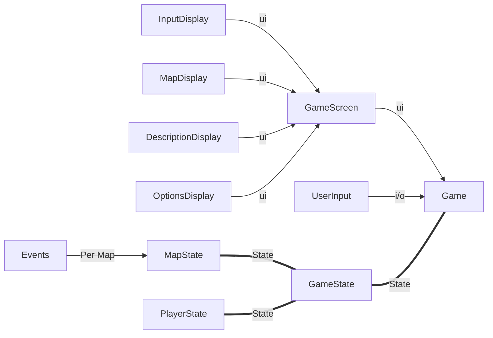
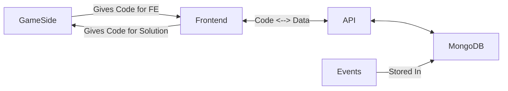

# Glass Dolls Game

---

## Diagrams

```mermaid
flowchart LR
    MapState
    PlayerState
    GameState

    Events

    InputDisplay
    MapDisplay
    DescriptionDisplay
    OptionsDisplay
    GameScreen

    Game

    UserInput

    %% Connections

    %% States

    MapState ===|State|GameState
    PlayerState ===|State|GameState

    %% UI
    InputDisplay -->|ui| GameScreen
    MapDisplay -->|ui| GameScreen
    DescriptionDisplay -->|ui| GameScreen   
    OptionsDisplay -->|ui| GameScreen

    %% Game
    GameScreen -->|ui| Game
    UserInput -->|i/o| Game
    GameState ===|State| Game

    Events -->|Per Map|MapState
```

```mermaid
flowchart LR
    API
    MongoDB
    Events
    GameSide
    Frontend

    Frontend <-->|Code <--> Data| API
    Frontend -->|Gives Code for Solution| GameSide
    API <--> MongoDB
    Events -->|Stored In|MongoDB
    GameSide -->|Gives Code for FE|Frontend
```

## Description

What is this?

## Quickstart

How do I use this?

## Developing

How do I do dev on this?

## Contributing

How do I contribute to this?
